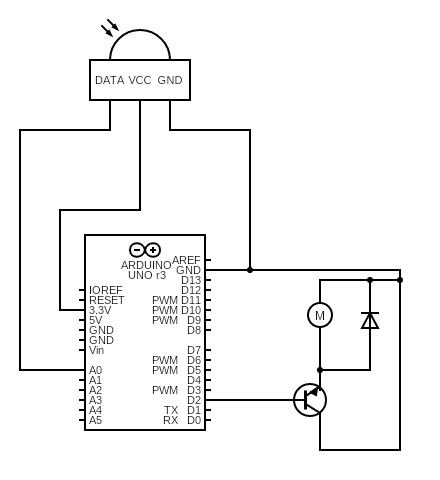

# AutomaticWatering

### What
This project attempts to track moisture level in the soil using a moisture sensor. 
And water plant when moisture level is lower than a threshold.

### Why
Different plant have different watering needs.

And so when I have 15 different house plant with different watering needs. Watering them all on the same day might not be the most effective solution.

By watering each individual plant only when they are needed automatically. 

This project allows me to water multiple house plants at home in a more granular way.

# Technology
### Hardware
- Arduino C
- Capacitative Soil Moisture Sensor
- ESP32
- Water Pump

# Future Enhancement
- A backend to track moisture and watering history
